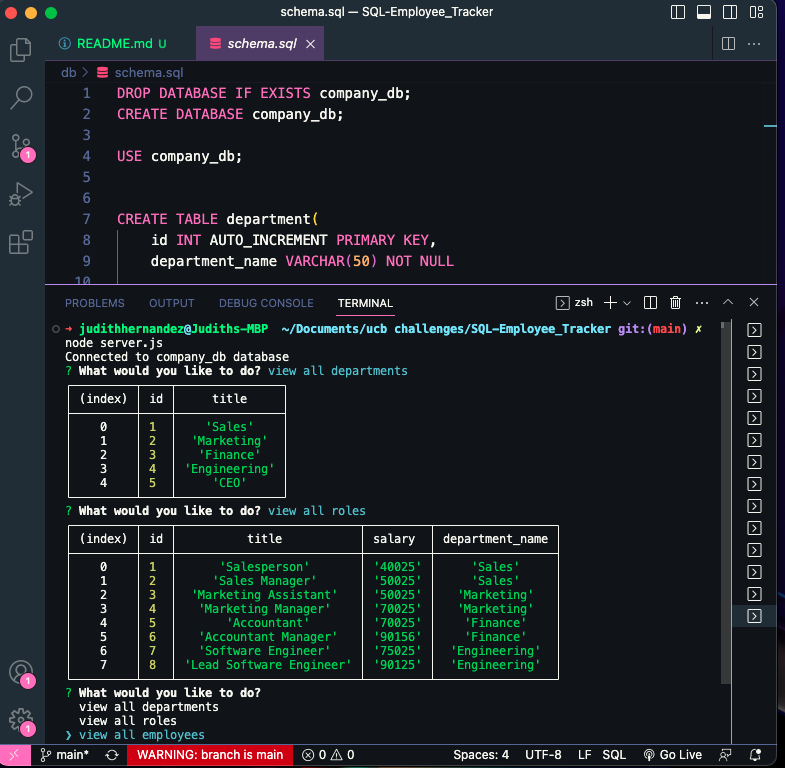

# SQL-Employee Tracker

## Description

This application was made for businesses to keep track of their companies. This app, made with Node.js, Inquirer, and MySQL allows business owners to see their company departments, roles, employees with their roles and salaries. It also shows employee managers if they have one. This app can be used to add new departments, add new roles, add new employees, and even update an employee role in the instance that an employee changes department or becomes a new manager.

## Table of Contents

- [Installation](#installation)
- [Usage](#usage)
- [License](#license)
- [Contributing](#contributing)
- [Tests](#tests)
- [Questions](#questions)

## Installation

To Install necessary dependencies, make sure to run the following command:
`npm i`

## Usage

To start this cli app, you can type node server.js in the terminal. Once this is done, you will be asked to choose an option. If you choose “view all departments,” “view all roles”, or “view all employees” you will be shown a table with the chosen data. You will then be asked again to choose an option. If you choose “add a department” you will be prompted to add the department name after which it will be added to the new department table. The same will be for adding a new role and adding a new employee. To see the new department, role,and new employee table changed, simply choose the table you wish to view to see the new data. To update an employee simply choose that option, type the name of the current employee and type the department role in which they will be updated to.
For full access simply click on this link: https://github.com/judy-her/sql-employee-tracker

For a video demo of this app click this link: https://www.loom.com/share/82c4d66ba98745618dc49396847a36a3?sid=9da5d98b-b027-4a9c-be54-4f929b125c7b

## License

This project is licensed under the [mit](https://opensource.org/licenses/MIT) license.

## Contributing

If you would like to contribute, you can find this repo at [judy-her](https://github.com/judy-her)

## Tests

To run tests, run the following command:
`npm test`

## Questions

For questions about the repo, feel free to email me Judith Hernandez at judith85dm@ucla.edu
